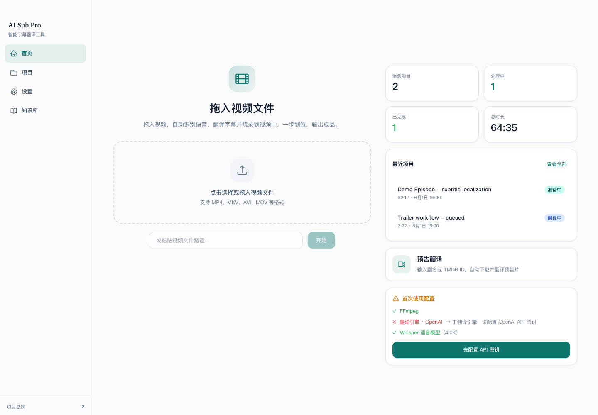

# AI Sub Pro

语言：[English](README.md) | [简体中文](README.zh-CN.md)

AI Sub Pro 是一个本地优先的桌面和 Web 字幕工作流工具，用于 AI 辅助字幕制作。
它可以帮助你转写视频音频、翻译字幕、编辑字幕轨、生成双语字幕，并基于
TMDB 与 YouTube 元数据创建预告片翻译项目。

应用由本地 FastAPI 后端和浏览器或 Electron/pywebview 前端组成。运行数据默认
保留在用户自己的电脑上。



## 文档

- [使用指南](docs/USAGE.md)：安装、配置、运行和导出字幕。
- [演示与截图](docs/DEMO.md)：主要工作流的界面预览。
- [发布说明](docs/RELEASE_NOTES.md)：当前公开版本摘要。

## 功能

- 上传本地视频文件，并在本地管理项目状态。
- 自动提取可用的内嵌字幕轨。
- 使用本地 Whisper 后端转写音频：`mlx-whisper`、`faster-whisper` 或
  `openai-whisper`。
- 使用 OpenAI 兼容接口、Claude CLI 或 Codex CLI 翻译和润色字幕。
- 维护本地知识库，用于人名、术语、风格规则和上下文词汇表。
- 搜索 TMDB，使用 `yt-dlp` 下载预告片，并生成预告片翻译项目。
- 导出原始、过滤后、翻译后和双语 `.srt` 字幕文件。
- 使用 `ffmpeg` 将字幕烧录到视频输出中。
- 可作为本地 Web 应用、Electron 外壳或打包后的 macOS/Windows 应用运行。

## 环境要求

- Python 3.10 或更高版本。
- Node.js 18 或更高版本。
- `ffmpeg` 和 `ffprobe` 需要在 `PATH` 中。
- 字幕烧录输出需要支持字幕渲染的 ffmpeg 构建。

可选 ASR 后端：

- Apple Silicon：`mlx-whisper`。
- 跨平台 VAD 与 beam search：`faster-whisper`。
- 备用方案：`openai-whisper`。

## 快速开始

```bash
git clone https://github.com/starrygao/AI_Sub_Pro.git
cd AI_Sub_Pro

python3 -m venv .venv
source .venv/bin/activate
pip install -r requirements.txt
pip install -r requirements-dev.txt

npm install
npm run build:css

./start.sh
```

如果浏览器没有自动打开，请访问 `http://127.0.0.1:18090`。

后端开发模式：

```bash
python3 app/main.py --headless
```

Electron 外壳：

```bash
cd electron
npm install
npm run start
```

## 配置

配置项通过应用界面管理。API key 和运行状态会写入本地数据目录，不应提交到
代码仓库。

开发模式下，数据默认保存在 `./data`。打包后的应用会将数据保存到用户应用数据
目录。可以通过下面的环境变量覆盖数据位置：

```bash
export AI_SUB_PRO_DATA_DIR=/absolute/path/to/runtime-data
```

更多可用环境变量见 `.env.example`。

## 测试

```bash
pip install -r requirements.txt
pip install -r requirements-dev.txt
npm install
npm run build:css
pytest
```

测试覆盖 API、任务调度、字幕解析、provider 行为、项目存储安全和前端
JavaScript。

## 打包

macOS：

```bash
bash build_mac.sh
bash make_dmg.sh
```

Windows：

```bat
build_win.bat
```

打包脚本需要本地工具链和可用的 `ffmpeg`/`ffprobe`。大型 ASR 模型不会提交到
仓库。离线打包模型时，可以使用 `AISUBPRO_ASR_MODEL_DIR` 或本地的
`models/asr`。

## 隐私与安全

AI Sub Pro 设计为在 localhost 本地运行。用户视频、字幕、生成音频、项目元数据、
API key 和知识库数据都属于本地运行数据。仓库默认排除了 `data/`、`build/`、
`dist/`、日志和模型缓存。

发布 fork 或 release 前，请扫描 secret，并避免提交真实项目中的示例媒体文件。

## 许可证

MIT。见 [LICENSE](LICENSE)。
