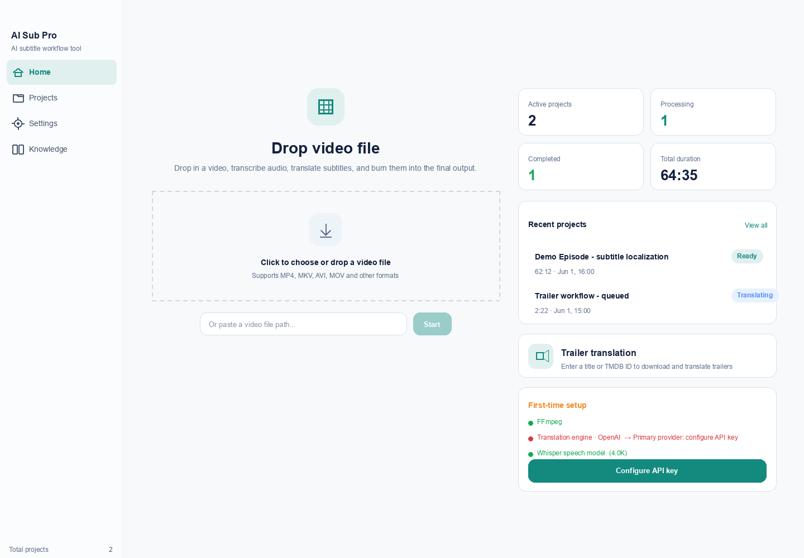
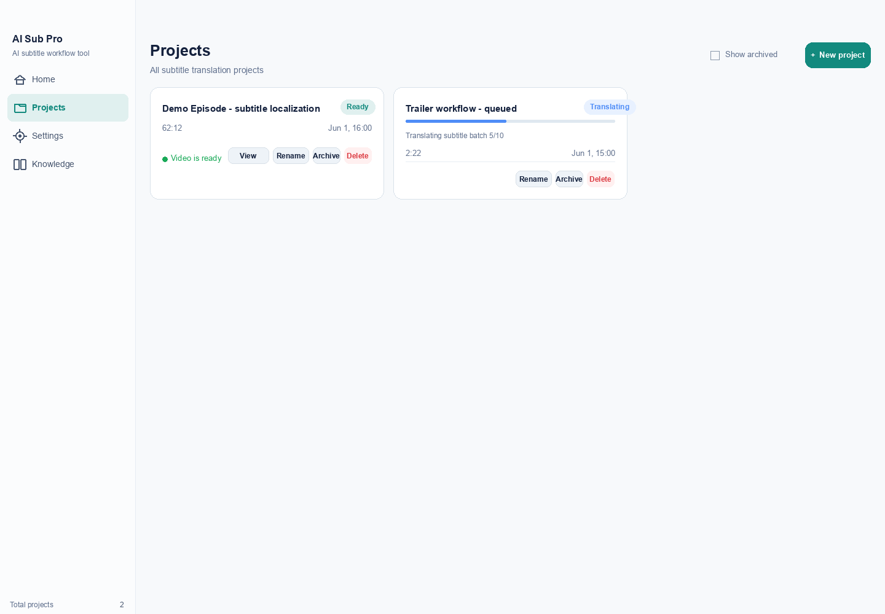
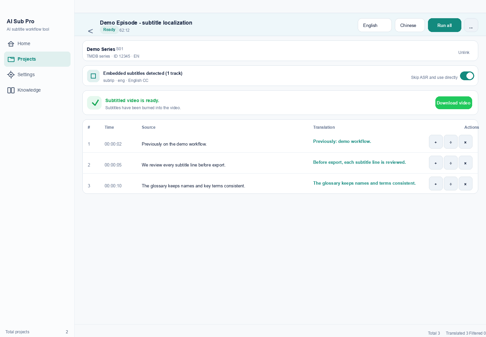
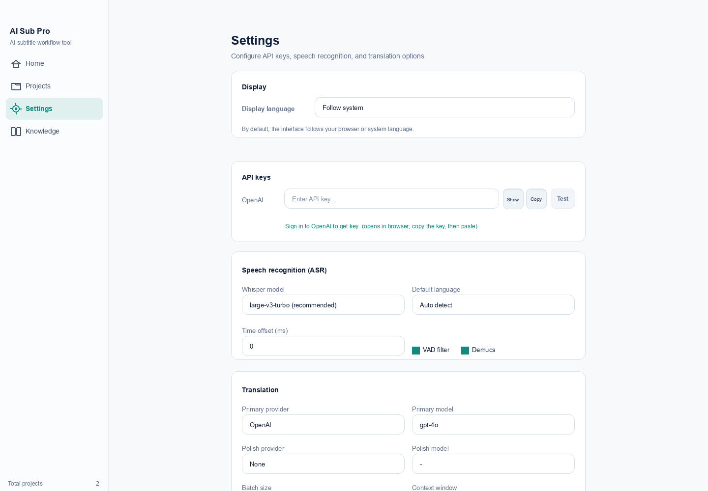

# Demo and Screenshots

Language: [English](DEMO.md) | [简体中文](DEMO.zh-CN.md)

The screenshots below use synthetic demo metadata and subtitle text. They do
not include user videos, real customer data, API keys, or private project files.

## Home

The home view accepts local video files and shows active, processing, completed,
and recent project state.

## Project List

The project list tracks ready, running, and archived projects with quick actions
for reveal, rename, archive, and delete.

## Subtitle Editor

The editor shows source and translated subtitle rows side by side. Maintainers
can edit translations, split rows, add rows, delete rows, export SRT files, and
burn final subtitles into video.

## Settings

Settings cover API keys, local CLI providers, ASR model options, translation
models, context windows, filters, and trailer configuration.

## Workflow Summary

1. Create a local project from a video file or trailer search.
2. Extract embedded subtitles or run local ASR.
3. Translate with the configured provider and knowledge-base context.
4. Review rows in the editor.
5. Export `.srt` files or burn subtitles into the final video.
