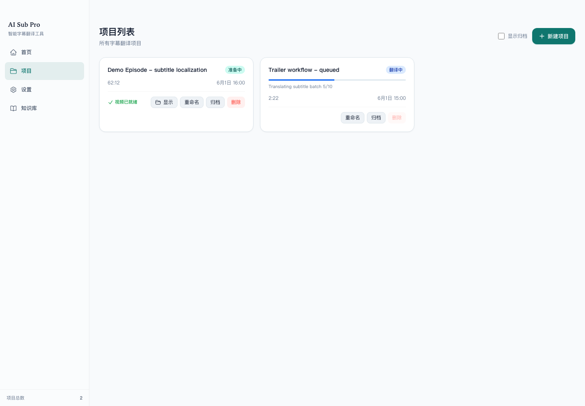
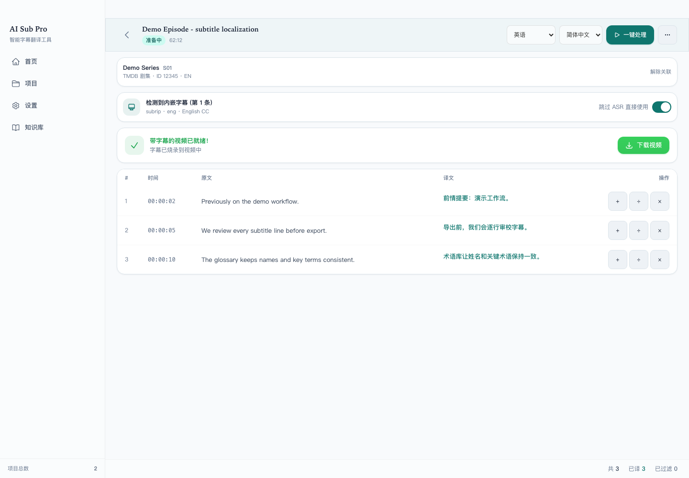
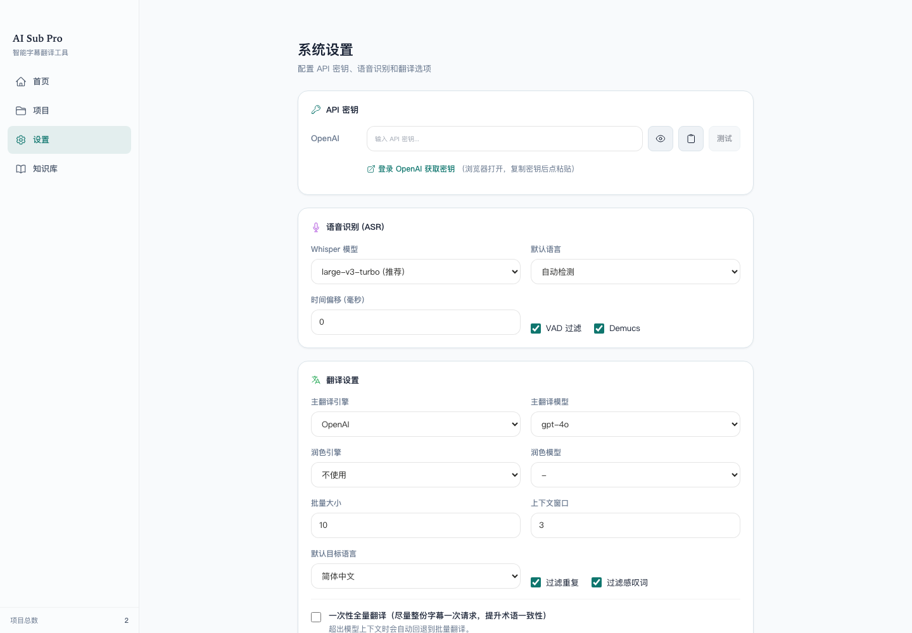

# 演示与截图

语言：[English](DEMO.md) | [简体中文](DEMO.zh-CN.md)

下面的截图使用合成演示元数据和字幕文本，不包含用户视频、真实客户数据、API key
或私有项目文件。

## 首页

首页支持拖入本地视频，并展示活跃项目、处理中项目、已完成项目和最近项目状态。

## 项目列表

项目列表展示准备中、运行中和已归档的项目，并提供显示、重命名、归档和删除等
快捷操作。

## 字幕编辑器

编辑器以左右并排方式展示原文和译文字幕。维护者可以编辑译文、拆分字幕行、
新增字幕行、删除字幕行、导出 SRT 文件，并将最终字幕烧录到视频中。

## 设置

设置页面包含 API key、本地 CLI provider、ASR 模型、翻译模型、上下文窗口、
过滤规则和预告片配置。

## 工作流摘要

1. 从本地视频或预告片搜索创建项目。
2. 提取内嵌字幕，或运行本地 ASR。
3. 使用配置好的 provider 和知识库上下文翻译字幕。
4. 在编辑器中审校字幕行。
5. 导出 `.srt` 文件，或将字幕烧录到最终视频中。
